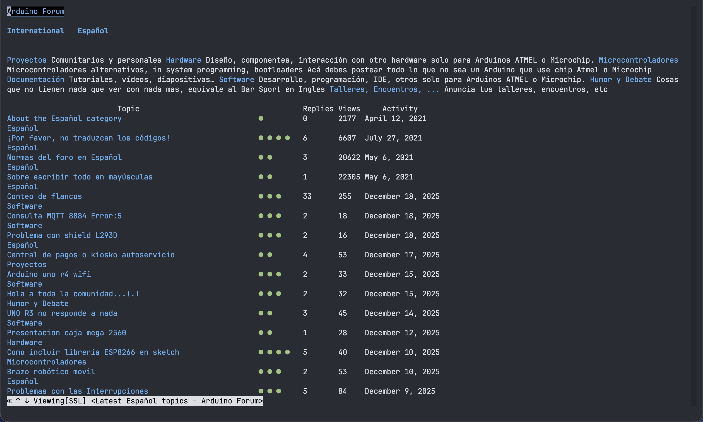

# w3m

一个在终端里浏览网页的经典工具

## Features

终端的眼睛。让你在纯终端环境中快速、直接地访问和浏览网页内容。
轻量、快速，支持表格、框架与鼠标操作，是服务器环境或无图形界面下的网页浏览利器。

## Rating

在终端中浏览网页的标杆，对于快速查阅文档或在线手册无可替代。受限于文本界面，复杂网页的渲染是天然的短板。

## Installation

使用系统包管理器安装，例如：
- Debian/Ubuntu: `sudo apt install w3m`
- macOS (Homebrew): `brew install w3m`
- Fedora: `sudo dnf install w3m`
- Arch Linux: `sudo pacman -S w3m`

